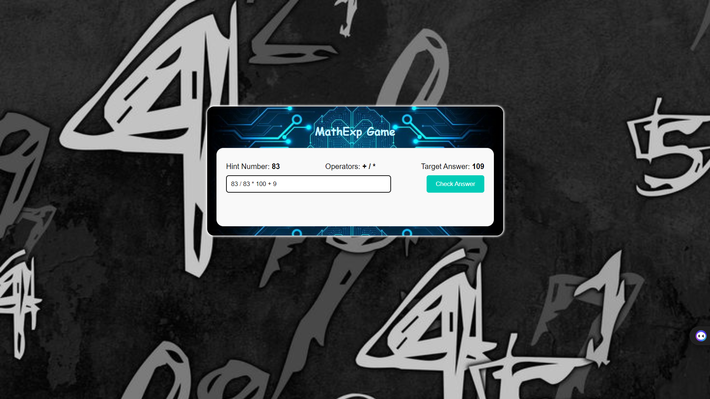
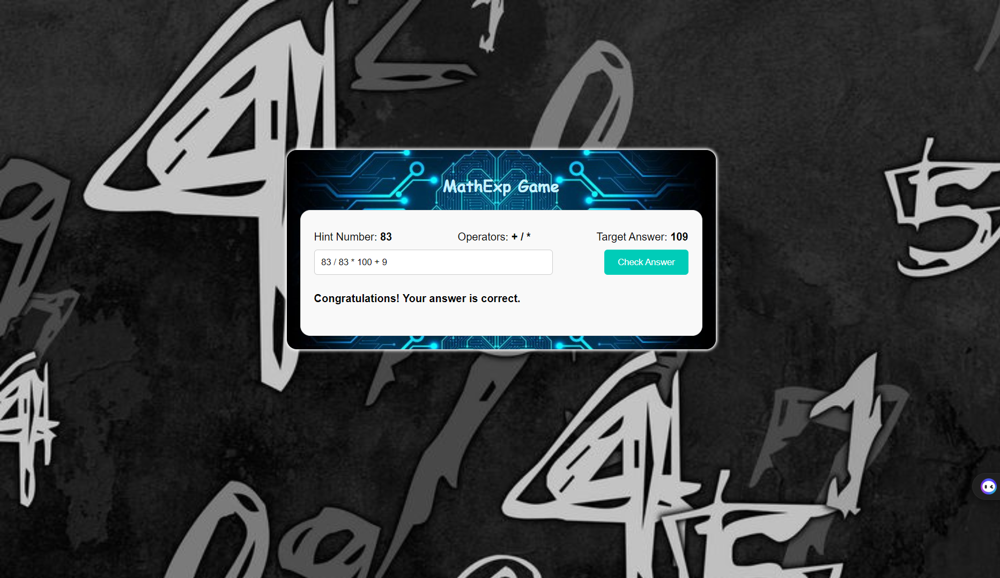

## 🎉 MathExp Game 🎉

Welcome to the MathExp Game! This is a fun and interactive game where players use given numbers and operators to match a target answer. Test your math skills and see if you can come up with the correct expression!

## 🚀 Getting Started

### Prerequisites

To run the game, you need a modern web browser. No additional software is required.

### Installation

1. **Clone the repository:**
   ```bash
   git clone https://github.com/your-username/mathexp-game.git
   ```

2. **Navigate to the project directory:**
   ```bash
   cd mathexp-game
   ```

3. **Open `index.html` in your preferred web browser:**
   ```bash
   open index.html
   ```

## 🕹️ How to Play

1. The game provides a **hint number** and a set of **operators**.
2. You need to create a mathematical expression using the provided hint number, operators, and other numbers.
3. Enter your expression in the input box and click **"Check Answer"**.
4. If your expression evaluates to the target answer using the given operators and hint number, you win! 🎉

## 📸 Screenshots


*Landing Page*


*Ques Page*


*Solved Page*


## 📄 Code Overview

### JavaScript (`script.js`)

- **Operators and Functions:**
  ```javascript
  const operators = {
    '+': (a, b) => a + b,
    '-': (a, b) => a - b,
    '*': (a, b) => a * b,
    '/': (a, b) => a / b,
  };
  ```

- **Game Logic:**
  - Get a random operator for hints.
  - Validate the user's expression.
  - Evaluate the user's expression.
  - Main game loop to start the game.

### HTML (`index.html`)

- Basic structure of the game interface.
- Elements to display hints, operators, target answer, and user input.

### CSS (`style.css`)

- Basic styling for the game interface. Customize to your preference.

## 📂 File Structure

```
mathexp-game/
│
├── index.html
├── style.css
└── script.js
```

## 🤝 Contributing

Contributions are welcome! Please fork the repository and submit a pull request with your changes.


## 📞 Contact

For any inquiries or feedback, please reach out to [yashbhai9876@gmail.com](mailto:yashbhai9876@gmail.com).

---

Enjoy the game and have fun! 🎉
